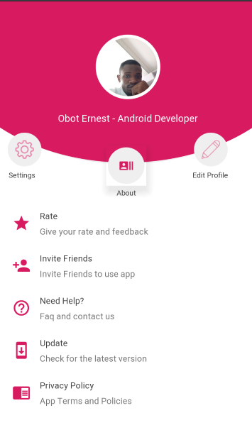

# User Profile Template
 This is a Simple User Profile Design App Template that i created just making it easier for me to implement or reuse the template, when developing an
 android application that needs a user profile activity or fragment. 
 
 This template was created with Android-X.
 
# Features
1. Share App with friends
2. Users can rate App
3. Users can now check for updated version of the app
4. Sample code provided for customization

 
# Design Pattern Used
This User Profile Design App Template makes use of Android Architecture Component (MVVM)
 
# Library used in this Template
- App Updater https://github.com/javiersantos/AppUpdater
- Butterknife (https://github.com/JakeWharton/butterknife)
- Circle Image View https://github.com/hdodenhof/CircleImageView
- Circle Button

***
#Screenshot

